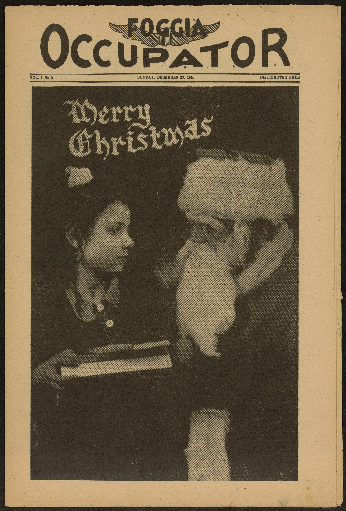

# The Foggia Occupator Dataset (1945-1946)

A complete digitized collection of *The Foggia Occupator*, a newspaper published by American forces during the post-WWII occupation of Foggia, Italy.

## Dataset Overview

- **Time Period**: 1945-1946
- **Total Issues**: 22
- **Articles**: 874
- **Word Count**: 216,015
- **Format**: JSON
- **Language**: English

## Description

*The Foggia Occupator* was published by American military forces stationed in Foggia, Italy, during the post-World War II occupation period. This dataset represents a complete digital archive of the newspaper, offering unique insights into:

- Daily life during the post-war American occupation of Italy
- Military-civilian relations in occupied territories
- Post-WWII reconstruction efforts
- American military culture and perspectives
- Local Italian news and events from an American viewpoint

## Data Structure

The dataset is provided as a JSON file containing a list of dictionaries. Each article is represented by a dictionary with the following structure:

{
    "id": "string",
    "content": "string",
    "publication_date": "string",
    "page_number": "integer",
    "article_number": integer"
}

## Usage

This dataset is intended for research on:

The history of post-WWII Italy
Military history 
Journalism history
Social and cultural analysis of occupation periods
Text analysis and digital humanities projects

## Citation

A full paper presenting this dataset is currently in press.

## License

The dataset is providded under a Creative Commons 4.0 License.

## Acknowledgments

The dataset was created with the help of the researchers at the Learning Sciences institute of the University of Foggia and the staff of the provincial library "La Magna Capitana". 

## Contact

For any information, please contact me at michele_ciletti.587188@unifg.it .
